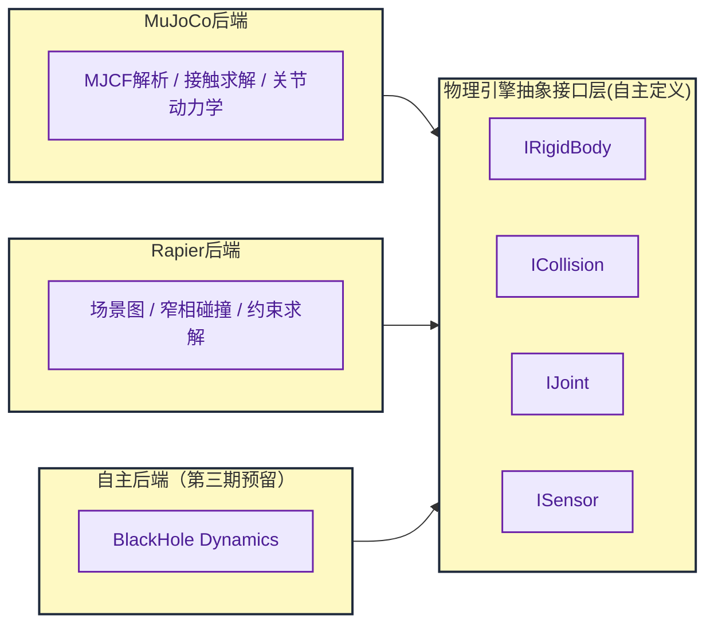

```mermaid
graph LR
    classDef yellowGroup fill:#FEF9C3,stroke:#1E293B,stroke-width:2px;
    classDef purpleBox fill:#EDE9FE,stroke:#6B21A8,stroke-width:1.5px,color:#4C1D95;

    subgraph MuJoCo["MuJoCo后端"]
        M1["MJCF解析 / 接触求解 / 关节动力学"]:::purpleBox
    end

    subgraph Rapier["Rapier后端"]
        R1["场景图 / 窄相碰撞 / 约束求解"]:::purpleBox
    end

    subgraph Self["自主后端（第三期预留）"]
        S1["BlackHole Dynamics"]:::purpleBox
    end

    subgraph Interface["物理引擎抽象接口层(自主定义)  "]
        direction LR
        I1["IRigidBody"]:::purpleBox
        I2["ICollision"]:::purpleBox
        I3["IJoint"]:::purpleBox
        I4["ISensor"]:::purpleBox
    end

    MuJoCo --> Interface
    Rapier --> Interface
    Self --> Interface

    class MuJoCo,Rapier,Self,Interface yellowGroup;
```