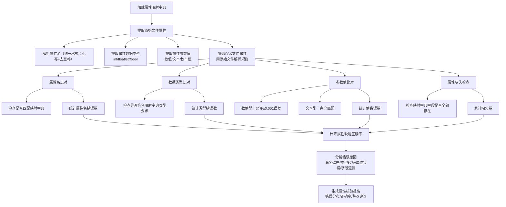

```mermaid
graph TD
    A[加载属性映射字典] --> B[提取原始文件属性]
    B --> B1[解析属性名（统一格式：小写+去空格）]
    B --> B2[提取属性数据类型<br>int/float/str/bool]
    B --> B3[提取属性参数值<br>数值/文本/枚举值]
    B --> C[提取PAK文件属性<br>同原始文件解析规则]
    
    C --> D[属性名比对]
    D --> D1[检查是否匹配映射字典]
    D --> D2[统计属性名错误数]
    
    C --> E[数据类型比对]
    E --> E1[检查是否符合映射字典类型要求]
    E --> E2[统计类型错误数]
    
    C --> F[参数值比对]
    F --> F1[数值型：允许±0.001误差]
    F --> F2[文本型：完全匹配]
    F --> F3[统计值错误数]
    
    C --> G[属性缺失检查]
    G --> G1[检查映射字典字段是否全部存在]
    G --> G2[统计缺失数]
    
    D2 --> H[计算属性映射正确率]
    E2 --> H
    F3 --> H
    G2 --> H
    
    H --> I[分析错误原因<br>命名偏差/类型转换/单位错误/字段遗漏]
    I --> J[生成属性核验报告<br>错误分布/正确率/整改建议]
```