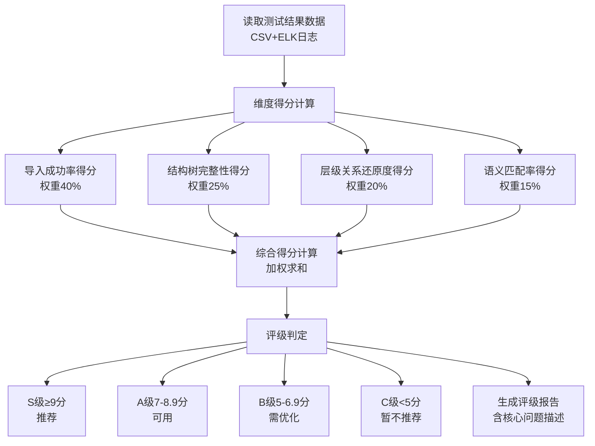

```mermaid
graph TD
    A[读取测试结果数据<br>CSV+ELK日志] --> B[维度得分计算]
    B --> B1[导入成功率得分<br>权重40%]
    B --> B2[结构树完整性得分<br>权重25%]
    B --> B3[层级关系还原度得分<br>权重20%]
    B --> B4[语义匹配率得分<br>权重15%]
    
    B1 --> C[综合得分计算<br>加权求和]
    B2 --> C
    B3 --> C
    B4 --> C
    
    C --> D[评级判定]
    D --> D1[S级≥9分<br>推荐]
    D --> D2[A级7-8.9分<br>可用]
    D --> D3[B级5-6.9分<br>需优化]
    D --> D4[C级<5分<br>暂不推荐]
    
    D --> E[生成评级报告<br>含核心问题描述]
```