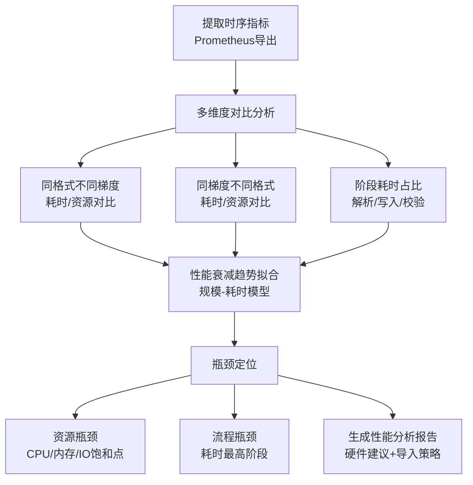

```mermaid
graph TD
    A[提取时序指标<br>Prometheus导出] --> B[多维度对比分析]
    B --> B1[同格式不同梯度<br>耗时/资源对比]
    B --> B2[同梯度不同格式<br>耗时/资源对比]
    B --> B3[阶段耗时占比<br>解析/写入/校验]
    
    B1 --> C[性能衰减趋势拟合<br>规模-耗时模型]
    B2 --> C
    B3 --> C
    
    C --> D[瓶颈定位]
    D --> D1[资源瓶颈<br>CPU/内存/IO饱和点]
    D --> D2[流程瓶颈<br>耗时最高阶段]
    
    D --> E[生成性能分析报告<br>硬件建议+导入策略]
```