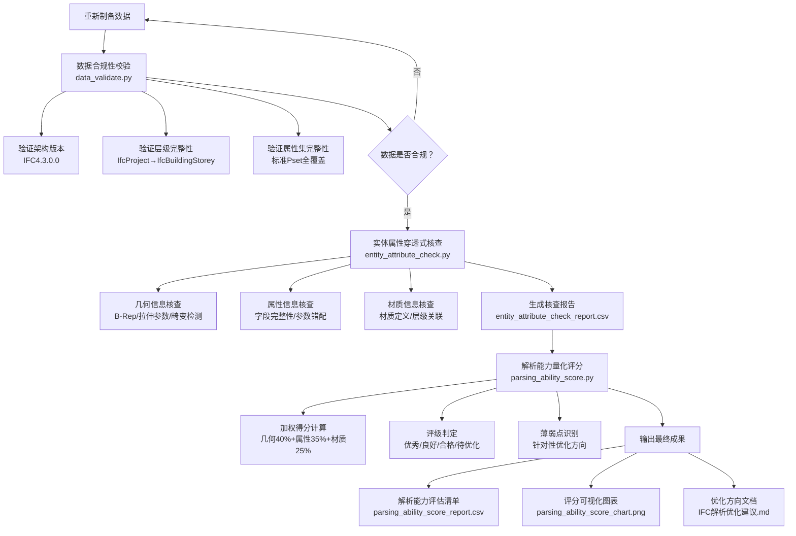

```mermaid
graph TD
    A[IFC测试数据制备<br>8类标准文件，符合ISO 16739:2018] --> B[数据合规性校验<br>data_validate.py]
    B --> B1[验证架构版本<br>IFC4.3.0.0]
    B --> B2[验证层级完整性<br>IfcProject→IfcBuildingStorey]
    B --> B3[验证属性集完整性<br>标准Pset全覆盖]
    B --> C{数据是否合规？}
    C -- 否 --> A[重新制备数据]
    C -- 是 --> D[实体属性穿透式核查<br>entity_attribute_check.py]
    
    D --> D1[几何信息核查<br>B-Rep/拉伸参数/畸变检测]
    D --> D2[属性信息核查<br>字段完整性/参数错配]
    D --> D3[材质信息核查<br>材质定义/层级关联]
    D --> E[生成核查报告<br>entity_attribute_check_report.csv]
    
    E --> F[解析能力量化评分<br>parsing_ability_score.py]
    F --> F1[加权得分计算<br>几何40%+属性35%+材质25%]
    F --> F2[评级判定<br>优秀/良好/合格/待优化]
    F --> F3[薄弱点识别<br>针对性优化方向]
    
    F --> G[输出最终成果]
    G --> G1[解析能力评估清单<br>parsing_ability_score_report.csv]
    G --> G2[评分可视化图表<br>parsing_ability_score_chart.png]
    G --> G3[优化方向文档<br>IFC解析优化建议.md]
```