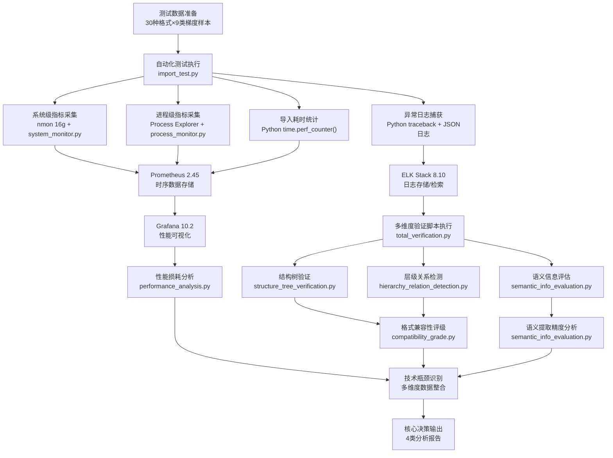

```mermaid
graph TD
    A["测试数据准备<br>30种格式×9类梯度样本"] --> B["自动化测试执行<br>import_test.py"]
    B --> B1["系统级指标采集<br>nmon 16g + system_monitor.py"]
    B --> B2["进程级指标采集<br>Process Explorer + process_monitor.py"]
    B --> B3["导入耗时统计<br>Python time.perf_counter()"]
    B --> B4["异常日志捕获<br>Python traceback + JSON日志"]
    
    B1 --> C["Prometheus 2.45<br>时序数据存储"]
    B2 --> C
    B3 --> C
    B4 --> D["ELK Stack 8.10<br>日志存储/检索"]
    
    C --> E["Grafana 10.2<br>性能可视化"]
    D --> F["多维度验证脚本执行<br>total_verification.py"]
    
    F --> F1["结构树验证<br>structure_tree_verification.py"]
    F --> F2["层级关系检测<br>hierarchy_relation_detection.py"]
    F --> F3["语义信息评估<br>semantic_info_evaluation.py"]
    
    E --> G1["性能损耗分析<br>performance_analysis.py"]
    F1 --> G2["格式兼容性评级<br>compatibility_grade.py"]
    F2 --> G2
    F3 --> G3["语义提取精度分析<br>semantic_info_evaluation.py"]
    G1 --> G4["技术瓶颈识别<br>多维度数据整合"]
    G2 --> G4
    G3 --> G4
    
    G4 --> H["核心决策输出<br>4类分析报告"]

```