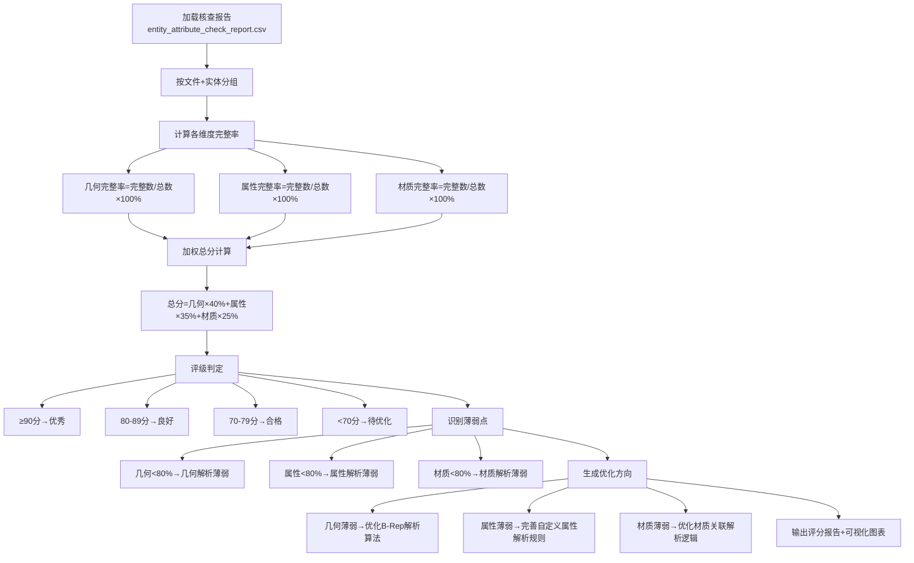

```mermaid
graph TD
    A["加载核查报告<br>entity_attribute_check_report.csv"] --> B[按文件+实体分组]
    B --> C[计算各维度完整率]
    C --> C1["几何完整率=完整数/总数×100%"]
    C --> C2["属性完整率=完整数/总数×100%"]
    C --> C3["材质完整率=完整数/总数×100%"]
    C1 --> D[加权总分计算]
    C2 --> D
    C3 --> D
    D --> D1[总分=几何×40%+属性×35%+材质×25%]
    D1 --> E[评级判定]
    E --> E1[≥90分→优秀]
    E --> E2[80-89分→良好]
    E --> E3[70-79分→合格]
    E --> E4[<70分→待优化]
    E --> F[识别薄弱点]
    F --> F1[几何<80%→几何解析薄弱]
    F --> F2[属性<80%→属性解析薄弱]
    F --> F3[材质<80%→材质解析薄弱]
    F --> G[生成优化方向]
    G --> G1[几何薄弱→优化B-Rep解析算法]
    G --> G2[属性薄弱→完善自定义属性解析规则]
    G --> G3[材质薄弱→优化材质关联解析逻辑]
    G --> H[输出评分报告+可视化图表]

```