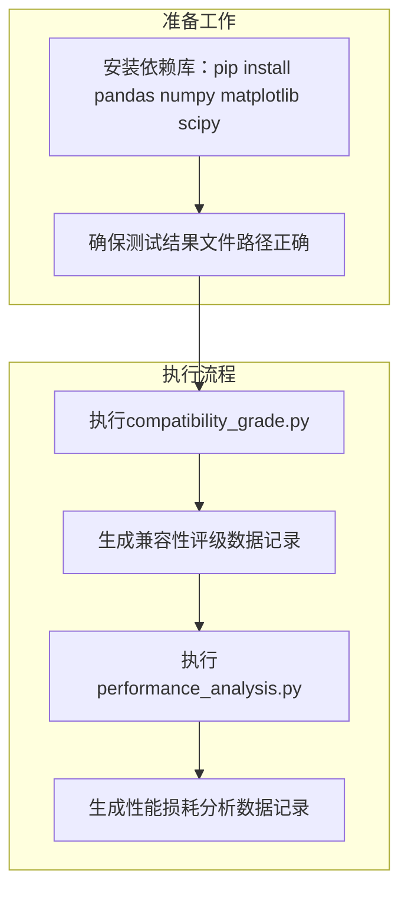

```mermaid
flowchart TD
    subgraph "准备工作"
        A[安装依赖库：pip install pandas numpy matplotlib scipy]
        B[确保测试结果文件路径正确]
    end

    subgraph "执行流程"
        C[执行compatibility_grade.py] --> D[生成兼容性评级数据记录]
        E[执行performance_analysis.py] --> F[生成性能损耗分析数据记录]
    end

    A --> B
    B --> C
    D --> E

```