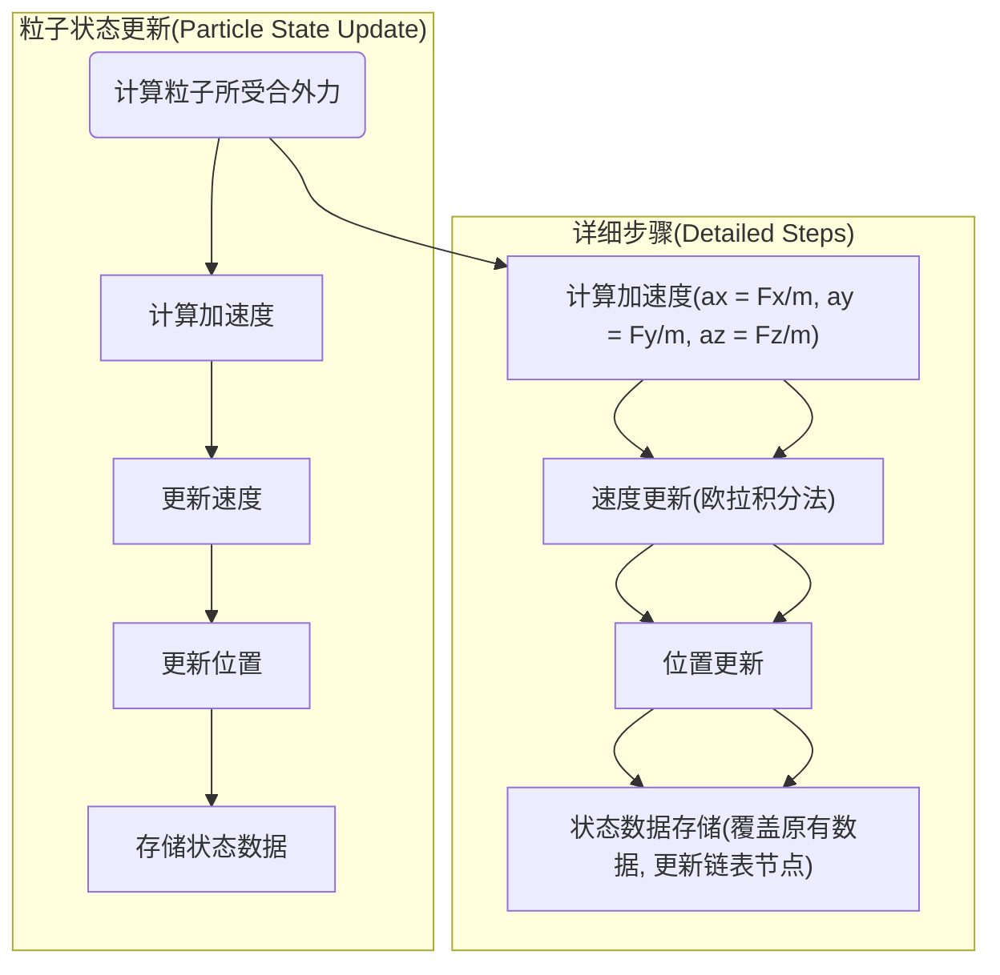

```mermaid
graph TD
    subgraph "粒子状态更新(Particle State Update)"
        direction TB
        A[计算合外力] --> B[计算加速度]
        B --> C[更新速度]
        C --> D[更新位置]
        D --> E[存储状态数据]
    end

    subgraph "详细步骤(Detailed Steps)"
        direction TB
        F["计算加速度(ax = Fx/m, ay = Fy/m, az = Fz/m)"] --> G["速度更新(欧拉积分法)"]
        G --> H[位置更新]
        H --> I["状态数据存储(覆盖原有数据, 更新链表节点)"]
    end


    A(计算粒子所受合外力) --> F
    F --> G
    G --> H
    H --> I
```