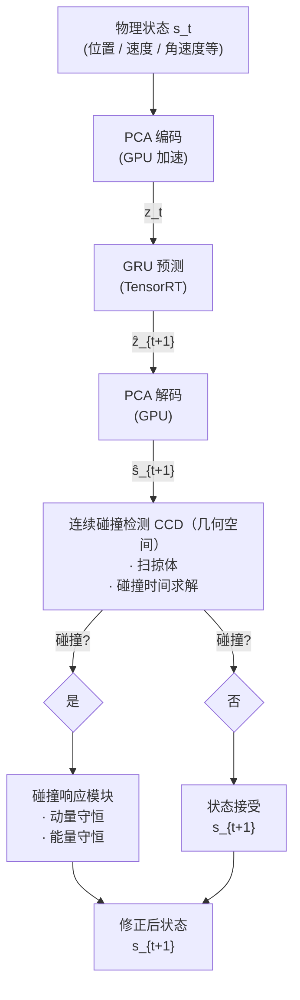

```mermaid
graph TD
    A["物理状态 s_t<br>(位置 / 速度 / 角速度等)"] --> B["PCA 编码<br>(GPU 加速)"]
    B -- z_t --> C["GRU 预测<br>(TensorRT)"]
    C -- ẑ_{t+1} --> D["PCA 解码<br>(GPU)"]
    D -- ŝ_{t+1} --> E["连续碰撞检测 CCD（几何空间）<br>· 扫掠体<br>· 碰撞时间求解"]
    E -- 碰撞? --> F{是}
    E -- 碰撞? --> G{否}
    F --> H["碰撞响应模块<br>· 动量守恒<br>· 能量守恒"]
    G --> I["状态接受<br>s_{t+1}"]
    H --> J["修正后状态<br>s_{t+1}"]
    I --> J

```