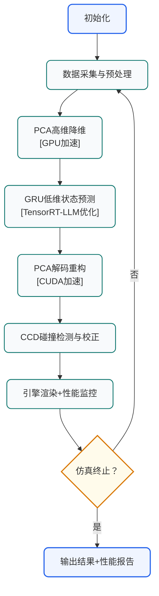

```mermaid
flowchart TD
    A[初始化] --> B[数据采集与预处理]
    B --> C["PCA高维降维<br/>[GPU加速]"]
    C --> D["GRU低维状态预测<br/>[TensorRT-LLM优化]"]
    D --> E["PCA解码重构<br/>[CUDA加速]"]
    E --> F[CCD碰撞检测与校正]
    F --> G[引擎渲染+性能监控]
    G --> H{仿真终止？}
    H -->|否| B
    H -->|是| I[输出结果+性能报告]
    classDef se fill:#f0f5ff,stroke:#2563eb,stroke-width:2px,rx:8
    classDef proc fill:#f8fafc,stroke:#0f766e,stroke-width:1.5px,rx:8
    classDef dec fill:#fffbeb,stroke:#d97706,stroke-width:2px,rx:8
    class A,I se
    class B,C,D,E,F,G proc
    class H dec

```