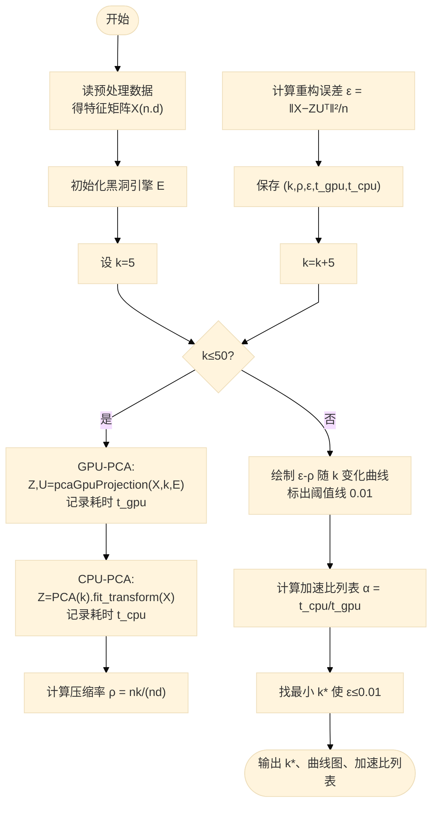

```mermaid
---
config:
  theme: base
  look: classic
  layout: fixed
---
flowchart TB
    A(["开始"]) --> B["读预处理数据<br>得特征矩阵X(n.d)"]
    B --> C["初始化黑洞引擎 E"]
    C --> D["设 k=5"]
    D --> E{"k≤50?"}
    E L_E_F_0@-- 是 --> F["GPU-PCA:<br>Z,U=pcaGpuProjection(X,k,E)<br>记录耗时 t_gpu"]
    F --> G["CPU-PCA:<br>Z=PCA(k).fit_transform(X)<br>记录耗时 t_cpu"]
    G --> H["计算压缩率 ρ = nk/(nd)"]
    I["计算重构误差 ε = ‖X−ZUᵀ‖²/n"] --> J["保存 (k,ρ,ε,t_gpu,t_cpu)"]
    J --> K["k=k+5"]
    K L_K_E_0@--> E
    E -- 否 --> L["绘制 ε-ρ 随 k 变化曲线<br>标出阈值线 0.01"]
    L --> M["计算加速比列表 α = t_cpu/t_gpu"]
    M --> N["找最小 k* 使 ε≤0.01"]
    N --> O(["输出 k*、曲线图、加速比列表"])


    L_E_F_0@{ curve: linear } 
    L_K_E_0@{ curve: linear }
    
```