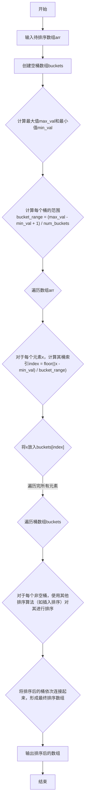

```mermaid
graph TD
    A[开始] --> B[输入待排序数组arr];
    B --> C[创建空桶数组buckets];
    C --> D{计算最大值max_val和最小值min_val};
    D --> E{"计算每个桶的范围bucket_range = (max_val - min_val + 1) / num_buckets"};
    E --> F{遍历数组arr};
    F --> G{"对于每个元素x，计算其桶索引index = floor((x - min_val) / bucket_range)"};
    G --> H{"将x放入buckets[index]"};
    H -- 遍历完所有元素 --> I{遍历桶数组buckets};
    I --> J{对于每个非空桶，使用其他排序算法（如插入排序）对其进行排序};
    J --> K{将排序后的桶依次连接起来，形成最终排序数组};
    K --> L[输出排序后的数组];
    L --> M[结束];

```